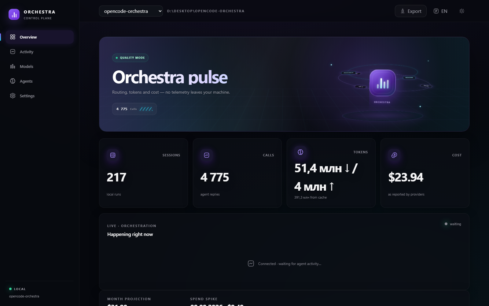
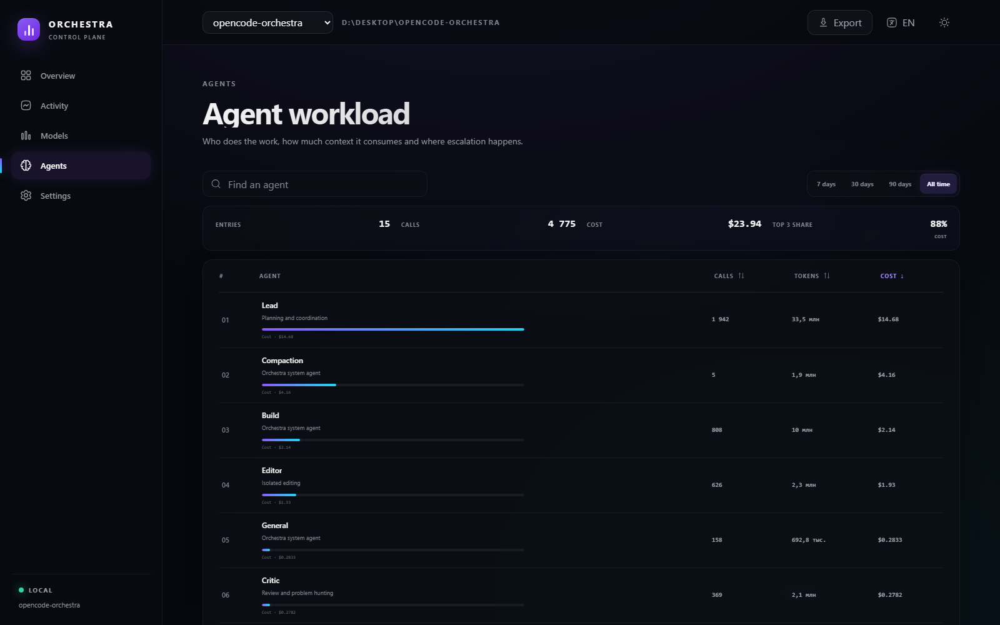

# OpenCode Orchestra

[](https://www.npmjs.com/package/@oeronteros-1/opencode-orchestra)
[](LICENSE)
[](https://opencode.ai/docs/plugins/)

**English** · [Русский](README.ru.md) · [简体中文](README.zh-CN.md)

OpenCode Orchestra turns a complex request into a controlled multi-agent workflow. It classifies the task, chooses connected models, dispatches focused specialists, merges their evidence, applies changes, verifies the result, and records local cost and usage telemetry.

- One primary agent with a team of focused, permission-scoped specialists
- Automatic model discovery, budget modes, per-agent overrides, and fallback chains
- Dependency-aware execution with hard concurrency, depth, and ownership limits
- Optional isolated Git worktrees for parallel editors
- Local dashboard for live activity, tokens, cost, models, agents, and MCP health
- Diagnostics, MCP smoke tests, bounded autonomous loops, and offline voice input

## Quick start

Requirements: [OpenCode](https://opencode.ai/), Bun 1.2 or newer, and a supported OpenCode model provider.

```bash
bunx @oeronteros-1/opencode-orchestra@latest install
```

Restart OpenCode, then run:

```text
/orchestra Find the cause of the intermittent login failure, fix it, and run the relevant tests
```

Useful status commands:

```text
/orchestra-status
/plugin-status
/orchestra-resume
```

The installer is idempotent. It backs up the OpenCode configuration before changing it and preserves existing plugins and MCP entries unless `--force` is explicitly supplied.

## Dashboard

The dashboard is local, token-protected, and bound to `127.0.0.1` by default. It shows live agent activity, usage trends, model and agent breakdowns, estimated or provider-reported cost, MCP health, anomalies, and exportable reports.

```bash
bunx @oeronteros-1/opencode-orchestra@latest dashboard
```





Prompts and replies are not persisted unless `telemetry.storeTexts` is explicitly enabled.

## How it works

```text
request
  → task classification and capability analysis
  → sealed dependency-aware plan with TaskContracts
  → parallel evidence workers, subject to shared limits
  → one provenance-preserving merge
  → optional judge for critical risk or unresolved disagreement
  → implementation, integration, and aggregate verification
  → local telemetry and cost accounting
```

In `ebobo` mode, tasks classified as research use a bounded research swarm. With the default eight-node limit, four workers explore independent hypotheses, two second-round workers receive every first-round result and reallocate their effort toward the strongest surviving directions, `orch-merge` consolidates the shared hypothesis ledger, and `orch-judge` independently verifies the candidate result. Mathematical proofs, conjectures, scientific hypotheses, failed approaches, counterexamples, and reusable intermediate results are carried between rounds with node provenance. A provisional or unresolved judge verdict is not treated as completion.

`orch-lead` is the public primary agent. It can edit the current workspace, run verification, and coordinate the rest of the team. Internal workers are hidden from normal agent completion by default and have narrower permissions.

| Agent | Role | Writes files |
|---|---|---:|
| `orch-lead` | Planning, coordination, implementation, and final verification | Yes |
| `orch-repo` | Repository structure, Git history, dependencies, and blast radius | No |
| `orch-docs` | Official documentation and upstream source | No |
| `orch-tests` | Reproduction paths, test coverage, and verification commands | No |
| `orch-research` | Standards, implementations, and ecosystem research | No |
| `orch-critic` | Independent review and assumption checking | No |
| `orch-security` | Trust boundaries, authorization, secrets, and data handling | No |
| `orch-visual-reference` | UI references, interaction patterns, and motion | No |
| `orch-visual-generate` | Exploratory visual generation | Generated assets only |
| `orch-visual-review` | Screenshot, hierarchy, accessibility, and regression review | No |
| `orch-editor` | Isolated implementation in an assigned worktree | Assigned scope only |
| `orch-integrator` | Deterministic, fail-closed integration of validated commits | Git integration only |
| `orch-merge` | Evidence synthesis with provenance and uncertainty | No |
| `orch-judge` | Arbitration for critical risk or unresolved disagreement | No |

### Execution guards

- `parallelWorkers` is the hard tree-wide concurrency limit.
- `maxWorkers` limits unique worker nodes across the entire task tree.
- `maxDelegationDepth` limits nested delegation.
- Every dispatched node receives a sealed TaskContract with its goal, inputs, completion criteria, allowed paths, exclusive resources, and delegation budget.
- Independent nodes that claim the same mutable resource are serialized.
- A failed dependency blocks downstream nodes instead of allowing partial execution to drift.

The default limits are eight workers, eight concurrent workers, and a delegation depth of two. Limits are enforced by the runtime, not only by prompts.

### Resume after restart

Orchestra stores the sealed plan, node states, dependency results, and validated Git commits locally in `.orchestra/orchestration/runs.json`. After a restart, active and queued nodes become pending and can be retried safely; completed nodes are not run again.

```text
/orchestra-resume
/orchestra-resume <original-session-id>
```

With no argument, the newest unfinished run is resumed. Persistence can be disabled or moved:

```jsonc
{
  "orchestration": {
    "persistence": {
      "enabled": true,
      "directory": ".orchestra/orchestration"
    }
  }
}
```

The state file is local but contains worker results. Protect its directory like the repository when those results may contain sensitive data.

### Verified completion

Before final checks, `orch-lead` registers exact commands and expected artifacts through `orchestration_set_verification`. Commands run through the normal `bash` tool, so OpenCode permissions still apply. The runtime marks a command gate as passed only after the matching call succeeds, and checks artifact existence directly inside the workspace.

`orchestration_complete` distinguishes working, claimed, failed, and verified completion. By default a run cannot become verified without at least one gate or while any plan node is unfinished or unsuccessful. This can be disabled with `orchestration.verification.required`; `orchestration.verification.maxGates` caps the number of gates.

### Per-task budget

In addition to the model-selection mode, you can set hard cost, token, and elapsed-time limits. A value of `0` disables that limit:

```jsonc
{
  "orchestration": {
    "taskBudget": {
      "maxCostUSD": 2,
      "maxTokens": 120000,
      "maxMinutes": 15,
      "unknownPricing": "warn"
    }
  }
}
```

Before execution, Orchestra estimates and reserves the whole DAG budget. A plan whose estimate already exceeds a limit is rejected. Between worker calls, the runtime checks actual cost and tokens from the local ledger; elapsed time starts with the run and survives restart. `unknownPricing: "block"` rejects or stops work when a price cannot be determined, while `"warn"` explicitly excludes unknown calls from the USD total. One call to `orchestra_route` can override these limits with `maxCostUSD`, `maxTokens`, and `maxMinutes`.

### Execution graph and adaptive teams

`ebobo` retains its full bounded team for maximum-quality arbitration; the minimal initial team applies to the other budget modes.

The dashboard **Runs** page renders the persisted dependency graph, node contracts, outputs, failures, completion gates, and task budget. A running branch can be cancelled and a failed, blocked, or cancelled branch can be retried. Retry invalidates downstream results and stale worker responses cannot overwrite the new attempt.

While a node is pending or active, the lead can send a bounded clarification through `orchestration_relay_context`. The update survives restart and retry, and an active dispatch asks the same worker session for a revised complete result before marking the node successful.

By default Orchestra starts with two specialists plus synthesis and keeps the remaining worker slots available. `orchestration_adapt` can add a versioned branch only for a concrete runtime trigger such as a failed reproduction, contradictory evidence, an authorization boundary, a documentation gap, a performance or visual regression, low confidence, or evidence-backed lack of progress. Every trigger needs evidence, repeated triggers are ignored, and the dashboard shows the resulting plan version. Configure this with `orchestration.adaptive.initialWorkers`, `maxExtensions`, and `minEvidenceItems`.

Loop progress uses successful nodes, validated commits, and passed verification gates. Rephrasing the same `MORE` reason no longer resets the no-progress limit.

### Built-in evaluations

`opencode-orchestra eval --json` emits the versioned five-case core suite and structural routing coverage for solo, eco, balanced, quality, and ebobo modes. Supply observed rows with `--results results.json` to compare success rate, elapsed time, USD cost, and tokens. `--write baseline.json` stores a report; a later `--baseline baseline.json` exits with status 2 when success falls by more than five percentage points or mean time/cost rises by more than 20%.

### Verified reusable knowledge

After `orchestration_complete` returns verified completion, `orchestra_knowledge_record` can store a decision, exact test command, or constraint with evidence, source run, plan version, Git revision, and affected paths. `orchestra_route` and `orchestra_knowledge_query` reuse valid entries. An entry becomes stale when it expires, its paths have uncommitted changes, or those paths changed after its source revision; stale entries are returned only as leads. The local store defaults to `.orchestra/knowledge/verified.json` and is bounded by `orchestration.knowledge.maxEntries`.

## Installation

The default installer configures the Orchestra plugin and attempts to provision its companion tools:

- [Superpowers](https://github.com/obra/superpowers) skills
- [Context7](https://github.com/upstash/context7) for current library documentation
- [Codebase Memory](https://github.com/DeusData/codebase-memory-mcp) for repository indexing and impact analysis
- [MemoryGraph](https://github.com/memory-graph/memory-graph) for durable decisions and reusable knowledge
- the official Git MCP, restricted to the active repository
- ast-grep MCP for structural code search
- Playwright MCP for browser inspection
- the local voice overlay and Whisper model on supported platforms

Provisioning failures for optional companions do not prevent the core plugin from being configured. Dead local MCP commands are not written when provisioning fails.

Common installation options:

```text
--no-context7
--no-codebase-memory
--no-memorygraph
--no-git
--no-ast-grep
--no-playwright
--no-superpowers
--no-voice
--no-deps
--dry-run
--force
--config-dir DIR
```

Inspect changes without writing files or downloading dependencies:

```bash
bunx @oeronteros-1/opencode-orchestra@latest install --dry-run
```

## Model routing

The default `auto` strategy discovers models exposed by connected OpenCode providers and derives their relevant capabilities, including tools, reasoning, vision, image output, and context size. Auto-discovery fills only empty pools and never overwrites a non-empty manual pool.

If discovery is temporarily unavailable, Orchestra leaves the agent model unset so OpenCode can preserve the user's current model.

### Budget modes

| Mode | Routing policy |
|---|---|
| `eco` | Prefer free models and restrict premium escalation |
| `balanced` | Prefer subscription/free models with limited premium escalation |
| `quality` | Prefer stronger lead models and allow paid candidates |
| `ebobo` | Use the bounded research swarm for research tasks, prefer frontier arbitration, and always consult the judge |

Budget modes affect model choice, paid-call limits, and escalation. They do not increase the runtime's worker limits.

### Per-agent models and fallback

```jsonc
{
  "$schema": "https://unpkg.com/@oeronteros-1/opencode-orchestra@latest/schema/opencode-orchestra.schema.json",
  "budget": "balanced",
  "models": {
    "strategy": "auto",
    "agents": {
      "orch-lead": "provider/primary-model",
      "orch-repo": "provider/code-model",
      "orch-judge": "provider/frontier-model"
    },
    "fallback": {
      "enabled": true,
      "maxRetries": 2,
      "agents": {
        "orch-repo": ["provider/backup-one", "provider/backup-two"]
      }
    }
  }
}
```

An exact `models.agents` override has the highest priority. Retryable failures such as rate limits, timeouts, and provider 5xx errors may advance to the next compatible model. Authentication, permission, and invalid-request failures stop the chain.

Runtime fallback and lifecycle accounting are performed directly for every Orchestra subagent. Editor dispatch creates an isolated Git worktree from the sealed base revision; the integrator runs in the primary checkout only after every editor commit passes validation. The primary lead remains on OpenCode's native path.

## Parallel editing

Parallel editors are experimental and disabled by default:

```jsonc
{
  "orchestration": {
    "parallelEditors": 3,
    "worktreeRoot": ".orchestra/worktrees"
  }
}
```

Each editor receives non-overlapping path ownership and an isolated Git worktree. Before integration, Orchestra validates the actual commit diff, ancestry, and ownership boundaries. The integrator builds a deterministic conflict map and integrates all validated commits or none of them.

On an ownership violation, ancestry failure, or Git conflict, integration fails closed and keeps the worktrees for diagnosis. The lead must still run aggregate verification after a successful integration.

## Bounded Loop

Bounded Loop lets `orch-lead` continue a single goal over multiple controlled iterations. It is opt-in:

```jsonc
{
  "orchestration": {
    "loop": {
      "enabled": true,
      "maxIterations": 10,
      "maxMinutes": 30,
      "noProgressLimit": 3
    }
  }
}
```

```text
/loop Fix the failing tests
/loop --file docs/plan.md
/loop status
/loop stop
```

Only an unquoted final `MORE: <remaining work>` line authorizes another iteration. When verification is required, `DONE: <summary>` completes the loop only after `orchestration_complete` succeeds; otherwise the loop becomes `unverified`. Permission requests and unknown replies pause the loop, while errors and new user messages stop it.

Bounded-loop state itself is in memory and is lost when OpenCode restarts. A non-empty `verifyCommand` still fails closed; safe verification runs through registered gates and OpenCode's normal permissioned tools.

## Voice input

The standard installer provisions a prebuilt local voice overlay for Linux x64 and Windows x64 and downloads the `ggml-base.bin` Whisper model. No audio is sent to a remote transcription service.

For the terminal UI, start:

```bash
voice-overlay
```

For OpenCode Web, run OpenCode and the local voice proxy in separate terminals:

```bash
opencode web --port 4096
bunx @oeronteros-1/opencode-orchestra@latest web
```

Then open `http://127.0.0.1:4097`. The microphone button is added next to the prompt submit button and inserts recognized text into the draft without sending it.

See [voice-overlay/README.md](voice-overlay/README.md) for platform requirements and troubleshooting.

## Configuration

Global configuration:

```text
~/.config/opencode/orchestra.jsonc
```

Project configuration:

```text
<project>/.opencode/orchestra.jsonc
```

Project values override global values; explicit plugin options override both. `OPENCODE_CONFIG_DIR` and `--config-dir` are supported.

A practical starting configuration:

```jsonc
{
  "$schema": "https://unpkg.com/@oeronteros-1/opencode-orchestra@latest/schema/opencode-orchestra.schema.json",
  "budget": "balanced",
  "models": {
    "strategy": "auto",
    "agents": {},
    "fallback": { "enabled": true, "maxRetries": 2, "agents": {} }
  },
  "orchestration": {
    "parallelWorkers": 8,
    "maxWorkers": 8,
    "maxDelegationDepth": 2,
    "parallelEditors": 0,
    "exposeWorkers": false
  },
  "permissions": { "autoAcceptAll": false },
  "telemetry": {
    "enabled": true,
    "directory": ".orchestra",
    "storeTexts": false
  },
  "pricing": {
    "estimate": true,
    "warnThresholdUSD": 0.5,
    "openrouter": { "enabled": false, "ttlHours": 12 }
  }
}
```

The complete contract and bounds are defined in [schema/opencode-orchestra.schema.json](schema/opencode-orchestra.schema.json). A larger example is available in [examples/.opencode/orchestra.jsonc](examples/.opencode/orchestra.jsonc).

`permissions.autoAcceptAll` approves every OpenCode permission prompt while enabled. It is disabled by default and should be used only in a trusted workspace.

## CLI reference

| Command | Purpose |
|---|---|
| `install` | Configure OpenCode and provision companion MCPs |
| `dashboard` | Start the local telemetry dashboard |
| `voice-web`, `web` | Proxy OpenCode Web with an inline offline microphone |
| `doctor` | Diagnose configuration, MCPs, and local toolchain paths |
| `mcp-smoke` | Launch enabled local MCPs and test `initialize`, `tools/list`, and safe calls |
| `eval` | Compare reproducible solo and Orchestra results and check a baseline |
| `update` | Check npm for a newer release |
| `completion` | Print completion for `zsh`, `bash`, or `pwsh` |

Examples:

```bash
bunx @oeronteros-1/opencode-orchestra@latest doctor --json
bunx @oeronteros-1/opencode-orchestra@latest mcp-smoke --directory . --json
bunx @oeronteros-1/opencode-orchestra@latest eval --results results.json --json
bunx @oeronteros-1/opencode-orchestra@latest update
bunx @oeronteros-1/opencode-orchestra@latest completion pwsh
```

`doctor` is offline and non-destructive. `mcp-smoke` starts configured local MCP processes and performs a real protocol handshake; remote and disabled entries are reported as skipped.

## Pricing and telemetry

Orchestra resolves prices in this order:

1. an explicit price on the configured model candidate;
2. provider-supplied pricing;
3. the bundled price snapshot or a configured private endpoint;
4. the optional public OpenRouter catalog fallback.

Unknown prices remain unknown and are never silently treated as free. Subscription candidates are tracked separately from free and paid candidates.

The local ledger records tokens, cost, model and agent identifiers, MCP success and latency aggregates, routing decisions, and sanitized reliability events. Raw MCP arguments and output are not stored. Prompt and response text storage is opt-in.

## Safety and privacy

- Dashboard and voice services bind to loopback by default.
- Dashboard URLs contain a random access token.
- Telemetry is stored locally under `.orchestra` by default.
- Message text is not persisted unless `telemetry.storeTexts: true`.
- Reliability events do not retain raw provider errors.
- Read-only workers cannot edit files and cannot use native unguarded delegation.
- The official Git MCP is restricted to the active repository.
- Dangerous Git reset operations are denied; mutating operations require the relevant agent permission.
- Invalid Orchestra configuration degrades to safe defaults without overwriting the invalid file.

## Requirements and development

- Bun 1.2+ for the recommended installer flow
- Node.js 22+ for development and Node-based tooling
- Python 3.10+ only when provisioning the PyPI MemoryGraph companion
- Git for worktree-based parallel editing and the Git MCP

```bash
npm ci
npm run check
npm run test:mcp-live
npm run build
npm pack --dry-run
```

The regular test suite is self-contained. `test:mcp-live` launches configured external MCP tools and is intended for an environment where those companions are installed.

## Troubleshooting

Start with:

```bash
bunx @oeronteros-1/opencode-orchestra@latest doctor
```

If a local MCP is configured but cannot start, run:

```bash
bunx @oeronteros-1/opencode-orchestra@latest mcp-smoke --directory .
```

Use `--json` for machine-readable diagnostics. On Windows, Orchestra resolves `.exe`, `.cmd`, and `.bat` shims and uses a safe `cmd.exe` fallback only where required.

## License

[MIT](LICENSE)
